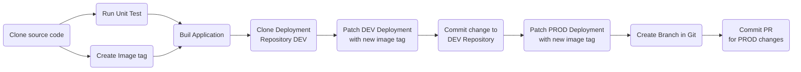
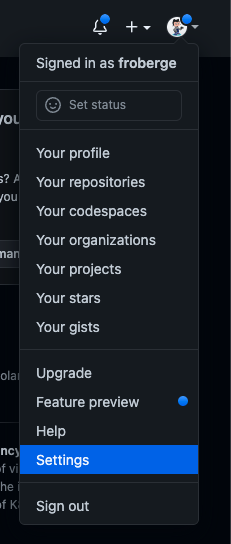
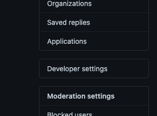
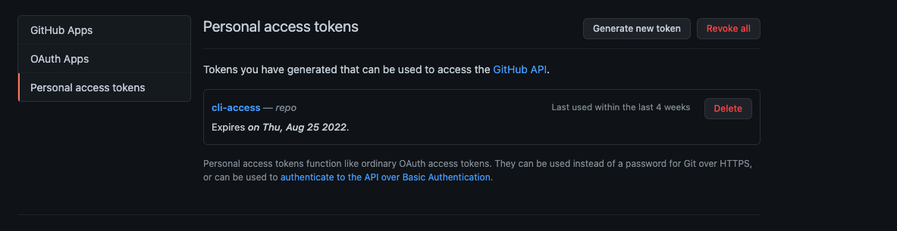
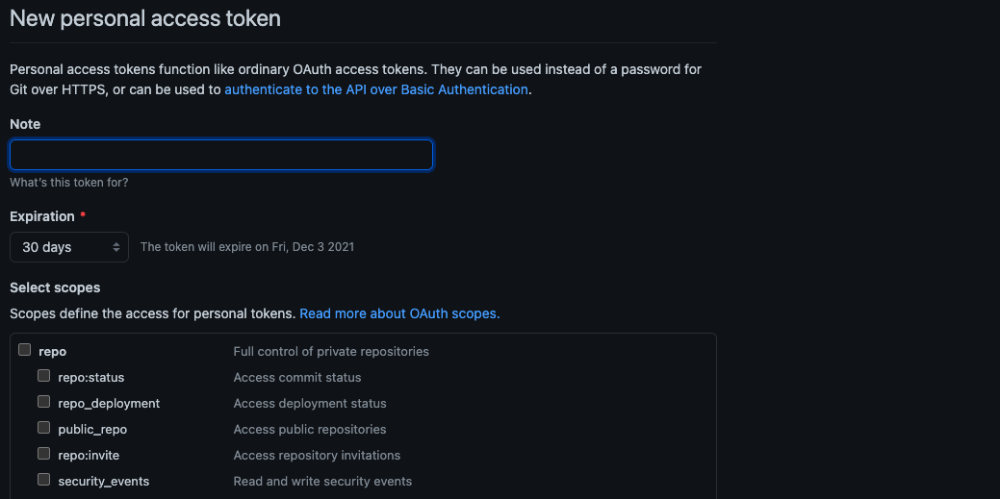
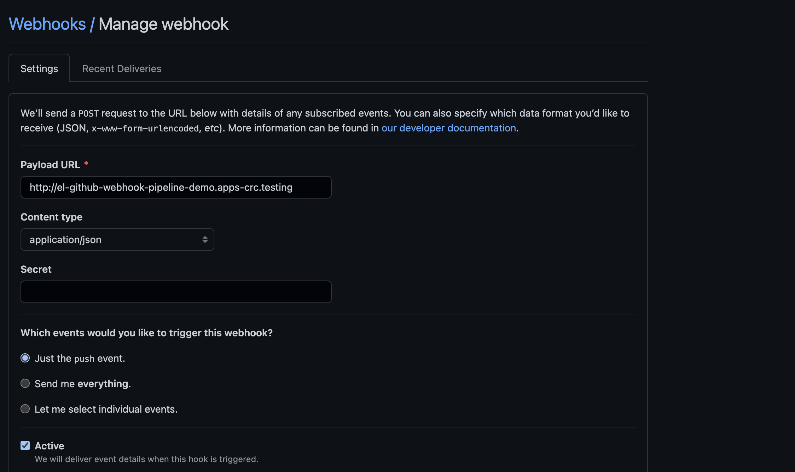

# AWS OpenShift Demo

This repository contains the different manifest needed to make OpenShift ready for development after the initial installation of OpenShift on AWS infrastructure. Is it used to implement the `best pratices` in day 2 operations such as the separation of concern between the application code and the cluster manifest.

The demo will explore different concepts tools and concepts needed for an healty management of an   OpenShift cluster such as:
* OpenShift Pipeline for CI
* OpenShift GitOps for CD
* Red Hat Build of Keycloak
* Deployment of a simple application in Quarkus. [Simple Quarkus Service](https://github.com/froberge/simple-quarkus-service).

 
### Prerequisite

1. Access to github
1. Clone/Fork of this repository
1. Access to an OpenShift Cluster
1. OpenShift CLI
1. [Optional] OpenShift GitOps operator install on the cluster to run the GitOps demo


### Deploy Using OpenShift GitOps

* `Have the OpenShift GitOps Operator install`. For instructions on how to install OpenShift Gitops you can refer to my [OpenShift GitOps Demo](https://github.com/froberge/ocp-gitops-demo) in this [section](https://github.com/froberge/ocp-gitops-demo/blob/main/docs/install-gitops-operator.md)


In this demo we will be demontrating how to use `OpenShift` Gitops to manage our cluster and to deploy an application. To achieve this we need 2 `ArgoCD instance`. One that managed the cluster and one manages the applications

__NOTE__
*   The default `cluster` instance of Argo CD is meant for cluster admin tasks like creating namespace managing role bindings, installation operators etc. not for day to day application management.

* `The Developer Argo CD instance` will be deploy in it own namespaces and is intented for the developper to use to manage the application.

1. Login to you cluster using the CLI

1. Use `kustomize` to create the different resources needed to run the demo 
    ```
    oc apply -k setup/overlays/demo
    ```

    This will create all the elements required    
        * __simple-quarkus-gitops__ - The namespace where the argoCD instance for Developer will be install.
        * __simple-quarkus-pipeline__ - The namespaces where the pipeline resources will be install.
        * __simple-quarkus-dev__ - The `DEV` environment for the demo.
        * __simple-quarkus-prod__ - The `PROD` environment for the demo.

### The Automation Flow.  

The automation flow uses a mix of Tekton(CI) and ArgoCD (CD).

Tekton Build the application and creates the PR. ArgoCD monitor the changes in Git. The Pipeline is trigger with a WebHook from GitHub.



### SetUp GitHub

We need to set up 2 different elements in GitHub
    1. A personel Token on you profile
    2. A Webhook on the code repository


#### Creation of a Personal token creation

From your [GitHub](github.com) account.

1. Under profile Select `setting`.
    

2. Select `Developer settings`

    

3. Select `Personal access tokens`

    

4. Click `Generate new token` and enter the information.

    

    * `Note`: A name for token
    * `Expiration`:When the token should expire according to you security policy.
    *  `Select scopes`: _Repo_ need to be selected at a minumun
    * Click `Generate token`

    > :warning: Copy the generated token in a secure place, since once the window is close, you won't be able to retrieve it. 
5. Create a folder `manifest-local` which is a copy of the  `manifest`. This contains information that should not be in your repository. Idealy this would be in a vault.

5. Generate the require secret for OpenShift to commit.
    * You need to edit the file `manifest-local/github-secret.yaml`
    * Replace following token with the appropriate value
        * `[CLEAR_TEXT_USERNAME]`
        * `[CLEAR_TEXT_TOKEN]`
    :warning: currently tekton only support basic_auth or ssh, this is why we need to generate one encrypted for the pull request that requires the encrypted token.

6. Generate the require encrypted secret for OpenShift to create a Pull Request.
    * You need to edit the file `manifest-local/github.yaml`
    * You need to replace in base64 the folowwing information
        * token: [64_encoded_token]
        * username: [64_encoded_username]
        * email: [64_encoded_email]
    * Apply the file to OpenShift
    ```
    oc apply -f manifest/github.yaml
    ```

---
##### Create the GitHub Webhook
1. Retrive the trigger url.     
    ```
    echo "$(oc  get route el-github-webhook -n simple-quarkus-pipeline  --template='http://{{.spec.host}}')"
    ```

2. Open [GitHub](https://github.com/)  in the the code repository, go to setting -> Webhook -> Add Webhook

    

You can now push a change to the repository, it should trigger the pipeline. 

---

#### Make different modification to the application to test the pipeline.

* Modify the source code will trigger the pipeline
* Modify the manifest it will trigger the ArgoCD sync


:tada: CONGRATULATIONS

You have now manage your cluster and your applicaiton using OpenShift GitOps on AWS.

