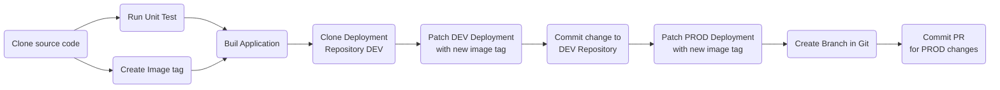

# AWS OpenShift Demo

This repository contains the different manifest needed to make OpenShift ready for development after the initial installation of OpenShift on AWS infrastructure. Is it used to implement the `best pratices` in day 2 operations such as the separation of concern between the application code and the cluster manifest.

The demo will explore different concepts tools and concepts needed for an healty management of an   OpenShift cluster such as:
* OpenShift Pipeline for CI
* OpenShift GitOps for CD
* Customization of the WebConsole
* Deployment of a simple application in Quarkus. [Simple Quarkus Service](https://github.com/froberge/simple-quarkus-service).

We will be demontrating how to use `OpenShift` Gitops to manage our cluster and to deploy an application. To achieve this we need 2 `ArgoCD instance`. One that managed the cluster and one that manages the applications
 
### Prerequisite

1. Access to github
1. Clone/Fork of this repository
1. Access to an OpenShift Cluster
1. OpenShift CLI
1. [Optional] OpenShift GitOps operator install on the cluster to run the GitOps demo
---

### Demo Setup

#### 1. Install the OpenShift GitOps on the Cluster

We need to have `OpenShift GitOps Operator install`. For instructions on how to install OpenShift Gitops you can refer to my [OpenShift GitOps Demo](https://github.com/froberge/ocp-gitops-demo) in this [section](https://github.com/froberge/ocp-gitops-demo/blob/main/docs/install-gitops-operator.md). For this demo we will be using the WebConsole to do this installation to see how easy it is to install or test an Operator in OpenShift.

__NOTE__
*   The default `cluster` instance of Argo CD is meant for cluster admin tasks like creating namespace managing role bindings, installation operators etc. not for day to day application management.

* `The Developer Argo CD instance` will be deploy in it own namespaces and is intented for the developper to use to manage the application.

#### 2. Create localfile with personal tokens
1. Create a folder `manifest-local` which is a copy of the  `manifest`. This contains information that should not be in your repository. Idealy this would be in a vault.

1. Generate the require secret for OpenShift to commit.
    * You need to edit the file `manifest-local/github-secret.yaml`
    * Replace following token with the appropriate value
        * `[CLEAR_TEXT_USERNAME]`
        * `[CLEAR_TEXT_TOKEN]`
    :warning: currently tekton only support basic_auth or ssh, this is why we need to generate one encrypted for the pull request that requires the encrypted token.

1. Generate the require encrypted secret for OpenShift to create a Pull Request.
    * You need to edit the file `manifest-local/github.yaml`
    * You need to replace in base64 the folowwing information
        * token: [64_encoded_token]
        * username: [64_encoded_username]
        * email: [64_encoded_email]
---
### Running the Demo

The rest of the demo will be done using using the cluster GitOps and Kustomize.

1. Login to you cluster using the CLI

1. Use `kustomize` to create the different resources needed to run the demo 
    ```
    until oc apply -k setup/overlays/demo
    do
     sleep 20
    done

    ```

    This will create all the elements required    
        * __simple-quarkus-gitops__ - The namespace where the argoCD instance for Developer will be install.
        * __simple-quarkus-pipeline__ - The namespaces where the pipeline resources will be install.
        * __simple-quarkus-dev__ - The `DEV` environment for the demo.
        * __simple-quarkus-prod__ - The `PROD` environment for the demo.
---

### The Tekton Pipeline Automation Flow.  

The automation flow uses a mix of Tekton(CI) and ArgoCD (CD).

Tekton Build the application and creates the PR. ArgoCD monitor the changes in Git. The Pipeline is trigger with a WebHook from GitHub.


---

#### Make different modification to the application to test the pipeline.

* Modify the source code will trigger the pipeline
* Modify the manifest it will trigger the ArgoCD sync


:tada: CONGRATULATIONS

You have now manage your cluster and your applicaiton using OpenShift GitOps on OpenShift running on AWS.

